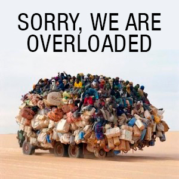

# Server Overloaded



## Description - English
Script that blocks the load when the server is overloaded.

## Description - Português 
Script em PHP que verifica se o servidor não está sobrecarregado. Caso esteja bloqueia o carregamento para evitar mais requisições.

### Version
V 0.3 (This script is in Beta version)

### How to use
To use this script, upload the file "overloaded.class.php" for your project. At the beginning of your script includes this code:
```<php>
include 'overloaded.class.php';
$serverover = new overloaded();
$serverover->check(30); //30 is the maximum percentage of processing
```

### Variables
Will be available in the next version

